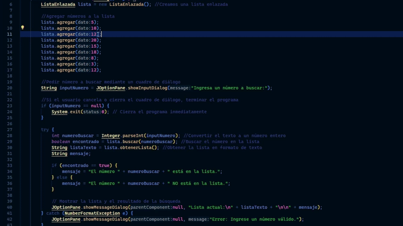

# ✅ Ejercicio de Listas Enlazadas Simples - Entregable #1

Este es el ejercicio de **Listas Enlazadas Simples** correspondiente al **Entregable #1** de la materia **Lógica de Programación II**, dictada por el profesor **Daniel Agudelo** ([@DanielDev87](https://github.com/DanielDev87)) en el **Tecnológico de Antioquia**.

En clases,  hemos aprendimos sobre el funcionamiento de las **listas enlazadas simples** y cómo implementarlas en **Java**. Basado en los ejercicios vistos, se ha desarrollado este programa que permite:

- Crear una lista enlazada simple.
- Agregar nodos con valores predefinidos.
- **Buscar un nodo específico en la lista.**
- Mostrar los resultados mediante **JOptionPane**.

## 📝 Uso del programa




1. Al ejecutar el programa, se mostrará un cuadro de diálogo solicitando al usuario un número a buscar.
2. El programa verificará si el número está en la lista enlazada.
3. Se mostrará la lista actual y el resultado de la búsqueda en un `JOptionPane`.
4. Si el usuario ingresa un valor no numérico, aparecerá un mensaje de error.
5. Si el usuario presiona **"Cancelar"**, el programa se cerrará inmediatamente.

## 📝 Ejemplo de salida
### ✅ Número encontrado
```
Lista actual:
5 -> 12 -> 20 -> 35 -> 50 -> null

El número 20 está en la lista.
```
### ❌ Número no encontrado
```
Lista actual:
5 -> 12 -> 20 -> 35 -> 50 -> null

El número 99 NO está en la lista.
```
### 📉 Entrada inválida
```
Error: Ingrese un número válido.
```

## 💼 Autor
- **Emmanuel Dávila** - Estudiante de Técnica Profesional en Sistemas, Tecnológico de Antioquia.

## ✅ Estado del proyecto
- ✔ Completado para el Entregable #1.


